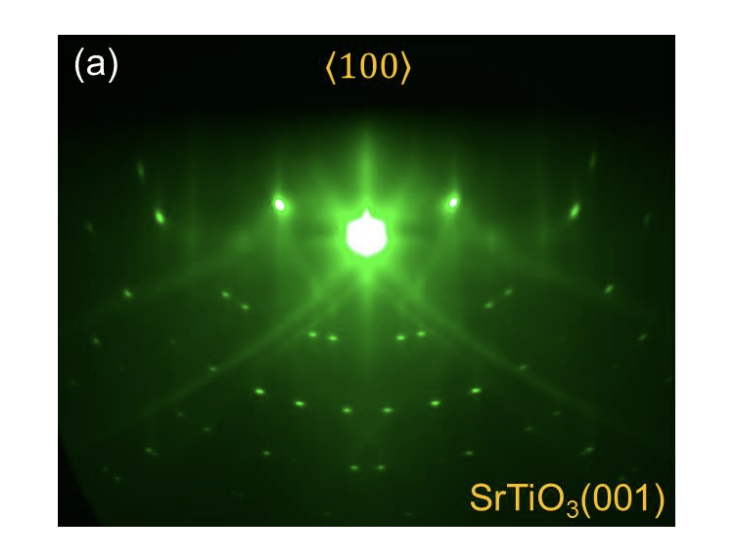
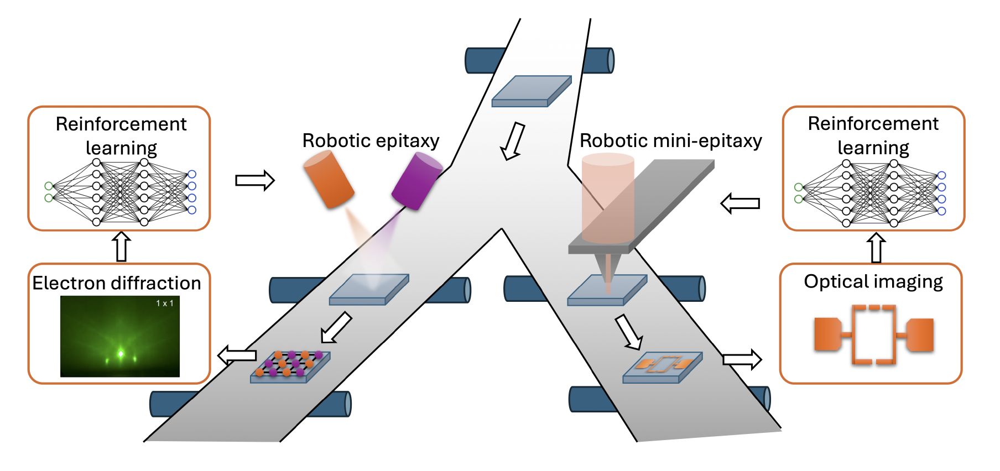

## AI-Guided Real-Time Characterization and Control for Quantum-Material Epitaxy

---

## 1. Project Background

Molecular beam epitaxy (MBE) growth of quantum materials produces a real-time RHEED (reflection high-energy electron diffraction) image stream that experts watch in order to identify surface reconstructions and adjust process conditions (temperature, oxygen pressure, shutter timing) on the fly. The diffraction patterns encode subtle surface-structure information that takes years of expertise to read; computational simulation of those same patterns reproduces their geometric structure but cannot be evaluated in real time during growth.

  <figure><figcaption>Real RHEED pattern of SrTiO3(001) along &lt;100&gt;.</figcaption></figure>
  <figure><figcaption>Robotic epitaxy / mini-epitaxy pipeline integrating RHEED and reinforcement-learning control.</figcaption></figure>

This project aims to **automate the expert-driven loop** — turning manual recipe-following into a closed-loop, AI-guided system that combines real-time RHEED characterization with structured reinforcement-learning (RL) control. The work unfolds in several stages:

- **Stage A — Characterization.** Build a real-time classifier that converts raw RHEED frames into a structured, machine-readable surface state (reconstruction type + quality score).
- **Stage B — Control.** Build a *control agent* that consumes the Stage-A state plus expert-supplied recipe instructions and outputs growth-condition control actions. The agent is not a single end-to-end network but an orchestrated system that brings together specialized modules — the Stage-A classifier as a state encoder, an instruction parser, and a learned control policy.
- **Stage C — Closed-loop integration.** Deploy the agent on the mini-epitaxy hardware for semi-closed-loop and ultimately fully closed-loop evaluation.

## 2. Project Progress

**Stage A is largely complete.** We have built and evaluated a **Bradley-Terry pairwise reward model** (the *Classifier*) that maps a single RHEED frame to a 5-dimensional reward vector and classifies it via **cross-type win-rate against ideal reference images**, with a same-type quality percentile. Trained on 996 expert-labeled pairwise comparisons + 147 ideal references + 31 "Bad" anchors collected through a custom web-based labeling tool, it achieves **89.8% pairwise-holdout accuracy** and **92.6% on a 4-class ideal-image split** — roughly doubling the SimCLR-only baseline. Code, trained weights, the labeling app, and analysis scripts are at **[github.com/ymeng3/AI_for_quantum](https://github.com/ymeng3/AI_for_quantum)**.

In parallel, the Yang Lab is collecting STO growth trajectory data through a GUI inference tool — this is the dataset Task 2 will use for RL training. New trajectory data with synchronized temperature / O₂-pressure / time logs is being acquired right now, so the data pool will continue to grow throughout the project.

---

## 3. Tasks

Task 1 polishes Stage A into a publishable methods contribution; Task 2 starts Stage B.

### Task 1 — Classifier validation and benchmarking *(paper-oriented)*

To turn Stage A from a working prototype into a defensible, publishable methods contribution, two pieces of work remain:

- **Baseline comparisons.** Position the Bradley-Terry + win-rate recipe against standard alternatives — plain ResNet-18 with cross-entropy on ideals, ViT, prototype networks on SimCLR features, SimCLR + linear probe. The goal is to demonstrate that *(a)* pairwise comparison labels are more sample-efficient than direct class labels for this kind of fine-grained scientific image data, and *(b)* the cross-type win-rate inference produces calibrated single-image predictions where naive argmax fails.
- **Theoretical thread (optional / paper-extension).** The cross-type-win-rate inference scheme is, to our knowledge, novel as a combination — Bradley-Terry preference models trained per-class, then aggregated to multi-class classification via reference-anchored win-rate. There is a natural connection to active triplet-ranking and low-rank latent embedding (Jamieson & Nowak, Tamuz et al. "Crowd-Kernel") that would strengthen the methodological claim and could turn the benchmarking work into a full paper.

**Deliverable.** Cross-validated benchmark numbers; a comparison table against standard baselines; a clean evaluation module integrated into the codebase; a paper draft covering the win-rate inference method.

### Task 2 — From classifier to controllable RL agent *(Stage B kickoff)*

**The end goal** is an **LLM-orchestrated agent** that takes a free-text expert recipe, decomposes it into phases, picks the right specialized modules for each phase (the Classifier as state encoder, a learned policy, appropriate reward signals), and controls growth in closed loop. Because growth proceeds in distinct phases (UHV anneal → high-T anneal → growth → post-anneal), each with a different target reconstruction, a natural architectural fit is a **goal-conditioned policy** that handles all phases with a single network conditioned on the current goal — for instance via bilinear factorization between state and goal (UVFA-style).

**Central design questions.** Two questions sit at the core of Task 2 and the intern's choices on them will largely shape the rest of the work:

1. **How to incorporate the Classifier into the RL design.** The Classifier's per-frame win-rate is already a continuous signal — should it be the reward directly, part of the state observation, both, or one term in a shaping function combined with other signals?
2. **How to incorporate live expert instructions into the RL design.** Growth runs produce real-time expert annotations ("aiming for HTR now," "increase T by 20°C"). These could enter the system as a conditioning goal for the policy, as a teacher-style supervisory signal, or as runtime reward shaping — the right framing is open.

**Other priors and signals worth exploring** as alternatives or complements to the Classifier:

- **Physics prior** — recipe-target tracking with temperature / O₂ penalties.
- **NMF-style decomposition** as a low-dimensional state signal. Our earlier attempt at this failed because NMF is **unsupervised** — without label guidance it allocates components to whatever varies most across pixels (brightness, screen geometry, camera artifacts) rather than to the diffraction features that distinguish reconstructions. Might work better in classifier-feature space, where the input is already setup-invariant.
- **VLM-as-judge** for periodic external validation. Too slow as a per-step reward but potentially useful as a sanity check during rollouts.

**Deliverable.** A working RL pipeline that closes the loop on a simulated or replayed environment — at minimum an environment wrapper, a baseline policy trained against a classifier-derived reward, and an evaluation script that visualizes the learned behaviour. From there, the intern picks one of the directions above to push further, accompanied by a short written exploration of which paths look most worth investing in.

---

## 4. What we provide, skills needed, and timeline

**Provided.** UChicago RCC computing resources; regular check-ins and mentorship from Professor Chen and Yang Meng; physics-side support from Haoran Lin and AJ Bradshaw.

**Skills.** Prior RL experience recommended. Comfortable Python / PyTorch fluency and basic familiarity with LLM APIs are expected for Task 2.

**Timeline.** Summer, potentially extending into autumn. We'll adjust as we go.
